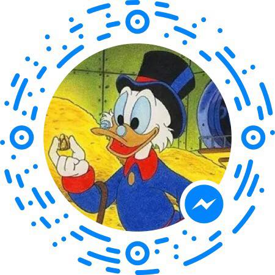

## Sobre 
"Tio Patinhas" é um chatbot para Facebook messenger. Ele serve para informar a cotação de moedas diversas e também de algumas criptomoedas. Todas as mensagens são em português brasileiro.

## Como falar com o Tio Patinhas?
Há 3 maneiras simples!
- Entrar em http://m.me/TioPatinhasBot  

- Enviar uma mensagem pela página https://www.facebook.com/TioPatinhasBot/  

- Scannear, pelo aplicativo do Facebook Messenger, o QR Code abaixo:  

## De onde vem a cotação?
A cotação é provida pela API https://www.cryptocompare.com/api/

## Fui na casa de câmbio e os valores estavam diferentes. Por quê?
O Tio Patinhas apresenta uma _estimativa_, porém casas de câmbio podem aplicar (e geralmente aplicam) taxas por cima das transações, bem como bancos, ou também incidem taxas de transferências por cartões, sem contar da flutuação natural do câmbio mundial. Apesar de fornecer uma _estimativa_, **os valores mostrados podem não refletir com exata precisão a realidade do câmbio**.

## Com quais moedas o Tio Patinhas trabalha?
Diversas! Algumas delas são: 

||Américas||
|:------------:|:------------:|:------------:|
| 🇧🇷  Real Brasileiro|🇺🇾 Pesos Uruguaios| 🇦🇷 Pesos Argentinos |
| 🇨🇱 Pesos Chilenos | 🇧🇴 Bolivians Bolivianos | 🇵🇪 Pesos Peruanos |
|🇵🇾 Guaranis Paraguaios|🇨🇴 Peso Colombiano|🇲🇽  Pesos Mexicanos|
|🇺🇸  Dólares Americano|🇨🇦  Dólares Canadenses|

 

||Europa / África||
|:------------:|:------------:|:------------:|
|🇧🇬  Lev Búlgaros| 🇨🇿  Coroas Checas| 🇩🇰  Coroas Dinamarquesas| 
|🇬🇧  Libras Esterlinas| 🇭🇺  Florim Húngaros| 🇪🇺  Euros| 
|🇨🇭  Francos Suiço| 🇳🇴  Coroas Norueguesas| 🇷🇺  Rublo Russos| 
|🇸🇪  Coroas Suecas| 🇭🇷  Kunas Croatas| 🇵🇱  Złoty Polonêses| 
|🇷🇴  Leu Romenos| 🇹🇷  Liras Turcas| 🇿🇦  Rand SulAfricanos |

 

||Ásia / Oriente Médio / Oceania||
|:------------:|:------------:|:------------:|
|🇦🇺  Dólares Australianos| 🇳🇿  Dólares Neozelandês| 🇨🇳  Yuan Renminbi Chinês| 
|🇭🇰  Dólares de Hong Kong| 🇮🇩  Rupias Indonesia| 🇮🇱  Shekel Israelenses| 
|🇮🇳  Rupias Indianas| 🇯🇵  Ienes Japoneses| 🇰🇷  Won sul-coreano| 
|🇲🇾  Ringgit Malaios| 🇹🇷  Liras Turcas| 🇷🇺  Rublo Russos| 
|🇵🇭  Pesos Philipino| 🇸🇬  Dólares de Singapura| 🇹🇭  Baht Thailandês| 

 

||Criptomoedas|| 
|:--------:|:--------:|:--------:|
|BTC - Bitcoin|LTC - Litecoin| ETH - Ethereum| 
|ZEC - Zcash| XRP - Ripple| XMR - Monero| 
|IOTA - IOTA| BTG - Bitcoin Gold |

## Exemplos de coisas que posso perguntar ao Tio Patinhas

- "Qual a cotação do dia?"
- "Quanto tá o dólar?"
- "20 reais em pesos uruguaios?"
- "Quanto é 50 euros em reais?"
- "Quanto tá o Bitcoin?"
- "Quanto são 2 bitcoins em reais?"
- "Quanto são 2 bitcoins em Etherum?"
- "Quanto é 100 pesos uruguaios em pesos argentinos?"

## Sugestões?

O Tio Patinhas ainda é um experimento, ou seja, está em fase de desenvolvimento. Se você:

- Quer sugerir moedas que não estão contempladas
- Notou respostas erradas ou não entendimento do bot com algumas perguntas
- Notou bugs
- Possui qualquer comentário/sugestão/reclamação sobre o projeto

Entre em contato pelo email freitag.matheus@gmail.com como assunto "Bot Tio Patinhas" e irei responder o mais rápido possível.

## Política de Privacidade
O Tio Patinhas **não requisita** nenhuma informação sensível e/ou pessoal, como informações de bancos, contas ou cartões, localização, destinos de viagem, nomes e quaisquer outras informações pessoais.
*__Não forneça__* esse tipo de informação, pois a responsabilidade é interiramente do usuário do bot. 

## Disclaimer
O nome do bot é "Tio Patinhas", mas seu criador não possui direitos de imagem e nome sobre o personagem que batiza o bot. Se você é ou representa alguma organização que possui direitos sobre o nome ou imagem do personagem e gostaria que estas informações sejam desvinculadas do bot, por favor entre em contato pelo email freitag.matheus@gmail.com.
